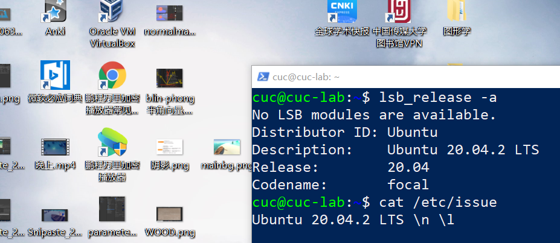
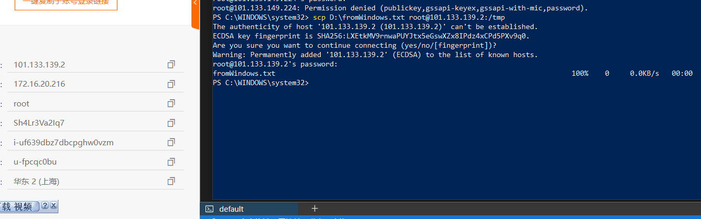

# ch0x01


---

## 0.实验环境

系统环境：Windows 10 家庭中文版 21H2 内部版本号19044.1586

虚拟机软件版本：VirtualBox 6.1.32 r149290（Qt 5.6.2）

部分情况下在Power Shell中使用SSH连接到虚拟机进行实验。


---

## 1.调查并记录实验环境的版本信息：

#### 1.1 获取当前 Linux 发行版基本信息

##### 1.1.1 lsb_release -a

输入命令：

```shell
lsb_release -a
```

可以查看Linux系统版本，结果如下：

  

 

##### 1.1.2 cat/etc/issue

除此之外，输入命令：

```shell
cat /etc/issue
```

也可以查看系统版本。得到的结果如下：

   


#### 1.2 获取当前 Linux 内核版本信息

##### 1.2.1 uname -a

输入命令

```shell
uname -a
```

即可得到内核版本信息：

  

​     

##### 1.2.2 cat/proc/version

除此之外，输入命令

```shell
cat /proc/version
```

也可以查看内核版本信息。得到的结果如下：

  


---

## 2.Virtualbox 安装完 Ubuntu 之后新添加的网卡如何实现系统开机自动启用和自动获取 IP？

#### 2.1 在Virtual Box中添加一块新的网卡


首先，在Virtual Box中启用一块新的网卡，将其设置为Host-Only网络，然后开启虚拟机

#### 2.2 实现开机自动启用新网卡

##### 2.2.1 检查新网卡是否启用

在Virtual Box中启用网卡后，在ubuntu中输入

```shell
ip a
```

查看网卡信息，得到的结果如下：


可以看到新添加的网卡并没有被启用。

##### 2.2.2 查找并修改安装配置文件

首先，输入命令来查找`installer-config.yaml`文件

```shell
cd /etc/netplan
ls
```


然后，输入

```shell
sudo vim /etc/netplan/00-installer-config.yaml
```

使用vim来编辑yaml文件。

进入后按`i`键进入insert模式，并将刚才添加的网卡`enp0s9`设置为`dhcp4 true`


按`esc`键回到命令模式，并输入`:`进入底线命令模式。然后输入`w`保存更改后的yaml文件。

再次输入`:q`退出vim


修改成功后，输入

```shell
sudo netplan apply
ifconfig
```

来应用新的修改，并查看修改是否成功，结果如下：


可以看到新添加的网卡enp0s9已经启用。

#### 2.3修改virtual box中host-only网卡设置

首先，在virtual box的主机网络管理器菜单中新建一张新的网卡Adapter #2，并且手动配置它的IPv4地址和DHCP服务器，把它和第一个默认的Adapter区分开：


然后，在虚拟机设置中将新网卡改为刚刚在主机网络管理器中创建的网卡Adapter #2：

  

启动虚拟机，输入

```shell
ifconfig
```

发现结果如下：


可以发现，有两张host-only网卡，一张是enp0s8，它被分配的ip地址是192.168.0.56.102，是按照virtual box主机网络管理器中默认的host-only 网卡规则分配的，ip地址第三个号段是56；

另一张是enp0s9，它被分配的地址是192.168.0.57.101，是按照virtual box主机网络管理器中我们新添加的host-only网卡（Adapter #2）的规则分配的，ip地址第三个号段是57。

这说明我们已经配置成功。


---

## 3.如何使用 `scp` 在「虚拟机和宿主机之间」、「本机和远程 Linux 系统之间」传输文件？

#### 3.1虚拟机与宿主机之间传输文件

用Administrator身份打开windows的powershell


并输入

```shell
scp D:\fromWindows.txt cuc@192.168.56.102:/tmp
```

其中，`D:\fromWindows.txt`是windows下文件存放的路径和文件名，`cuc@192.168.56.102:/tmp`是虚拟机上文件将要存放的位置。

可以发现文件被成功地传输到了虚拟机。

#### 3.2本机和远程Linux系统之间传输文件

首先在[云起实验室](https://developer.aliyun.com/adc/)创建一个Linux体验场景资源，然后获得它的ip和root用户密码。


然后打开windows机上的powershell，并输入

```shell
scp D:\fromWindows.txt root@101.133.149.224:/tmp
```

结果如下：



powershell提示已成功发送。

回到码云的linux中，输入

```shell
cd /tmp
ls
```

进入对应的目录，并检查文件是否成功发送，结果如下：


我们发送的fromWindows.txt已经成功被传输到了远程Linux系统上。


---

## 4.如何配置 SSH 免密登录？

#### 4.1将windows公钥发送到ubuntu

首先在windows的`C:\Users\Limko\.ssh`文件夹下找到公钥文件`id_rsa.pub`，然后使用`scp`将其发送到虚拟机上


存放至虚拟机的`~/.ssh`目录下。

#### 4.2上传公钥为已认证的公钥

在Ubuntu中执行

```shell
cat ~/.ssh/id_rsa.pub >> ~/.ssh/authorized_keys
```

来认证windows宿主机发送过来的公钥

#### 4.3修改属性

在Ubuntu中执行

```shell
sudo chmod 600 authorized_keys
sudo chmod 700 ~/.ssh
```

将已认证的公钥信息这个文件设置为拥有着可读写，其他人不可读写；

将.ssh文件夹设置为只有拥有者拥有读、写、执行权限

#### 4.4验证免密登录

最后在windows的powershell中验证免密登录是否设置成功


可以发现，在ssh命令之后并未提示输入密码，就成功地登录了。说明配置成功。


---

## 5.参考链接

[gitbash教程](https://blog.csdn.net/qq_36667170/article/details/79085301)

[网卡配置](https://blog.csdn.net/xiongyangg/article/details/110206220)

[scp教程](https://www.cnblogs.com/johnnyzen/p/13256602.html)

[使用scp提示Permission Denied解决方案](https://zhuanlan.zhihu.com/p/97306144)

[Linux权限详解](https://blog.csdn.net/u013197629/article/details/73608613)

[Windows通过ssh免密登录Linux](https://blog.csdn.net/caesar1228/article/details/120921248)

